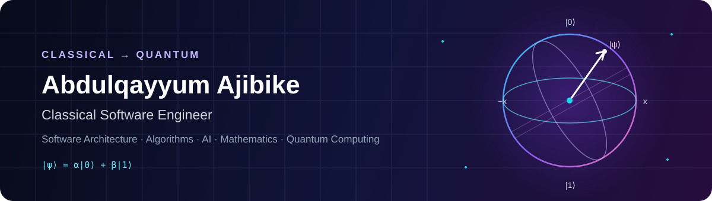
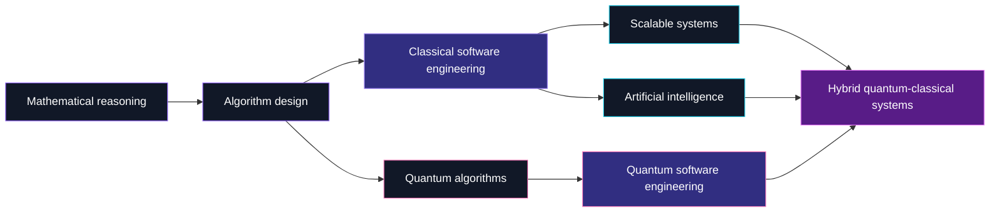

 

## Hello — I'm Abdulqayyum Ajibike

I am a **Software Engineer with years of experience** designing and developing scalable software across diverse domains. My foundation is in software engineering, mathematical reasoning, algorithmic thinking, and solving complex problems from first principles.

My engineering work spans **backend and full-stack development, APIs, software architecture, databases, cloud technologies, and distributed systems**. I also bring experience in technical leadership, stakeholder collaboration, community building, and mentoring engineers to deliver dependable, useful software.

I am now applying that classical engineering foundation to **quantum computing, quantum software engineering, quantum algorithms, artificial intelligence, mathematics, and computational research**—especially the boundary where classical and emerging computational paradigms meet.

> I am interested in more than using tools: I want to understand computational problems, model them rigorously, design the right algorithms, and engineer solutions that hold up in the real world.

## Current direction

## Capability map

| Area | What I bring |
|:--|:--|
| **Software engineering** | System design, clean architecture, API development, testing, maintainability, and complex problem solving |
| **Backend & distributed systems** | C#/.NET, Node.js, REST APIs, service integration, event-driven systems, NATS, and data modelling |
| **Full-stack delivery** | React, Next.js, TypeScript, Flutter, Dart, and end-to-end product development |
| **Data & AI** | Python, Jupyter, machine-learning experimentation, numerical methods, and research-driven analysis |
| **Quantum computing** | Qiskit, quantum circuits, foundational algorithms, hybrid quantum-classical thinking, and active study |
| **Technical leadership** | Mentoring, team collaboration, stakeholder engagement, knowledge sharing, and community building |

## Selected work

<table>
  <tr>
    <td width="50%" valign="top">
      <h3>⚛️ <a href="https://github.com/Ambaaq-Ajibike/QGSS26">QGSS26</a></h3>
      
Quantum-computing notebooks and practical exercises developed through the 2026 Qiskit Global Summer School.

      
<code>Qiskit</code> <code>Python</code> <code>Jupyter</code> <code>Quantum Circuits</code>

    </td>
    <td width="50%" valign="top">
      <h3>🏥 <a href="https://github.com/Ambaaq-Ajibike/SmartCoIHA">SmartCoIHA</a></h3>
      
Federated healthcare platform designed around privacy, consent, interoperability, and layered architecture.

      
<code>C#</code> <code>TypeScript</code> <code>Dart</code> <code>Distributed Systems</code>

    </td>
  </tr>
  <tr>
    <td width="50%" valign="top">
      <h3>🧠 <a href="https://github.com/Ambaaq-Ajibike/Diabetes-Prediction-using-Machine-Learning">Diabetes Prediction</a></h3>
      
Applied machine-learning exploration connecting data analysis, modelling, and predictive computation.

      
<code>Python</code> <code>Machine Learning</code> <code>Jupyter</code>

    </td>
    <td width="50%" valign="top">
      <h3>🔨 <a href="https://github.com/Ambaaq-Ajibike/Online-Auction-System">Online Auction System</a></h3>
      
Microservices-based auction platform with asynchronous messaging, payments, and persistent data.

      
<code>.NET</code> <code>NATS</code> <code>Paystack</code> <code>EF Core</code>

    </td>
  </tr>
  <tr>
    <td width="50%" valign="top">
      <h3>🛡️ <a href="https://github.com/Ambaaq-Ajibike/trust-route">TrustRoute</a></h3>
      
A recent TypeScript-based platform demonstrating end-to-end product and systems engineering.

      
<code>TypeScript</code> <code>APIs</code> <code>Architecture</code>

    </td>
    <td width="50%" valign="top">
      <h3>📐 <a href="https://github.com/Ambaaq-Ajibike/Manual-Numerical-Computations-of-Similarity-Measures">Similarity Measures</a></h3>
      
First-principles numerical computation of similarity measures, reflecting mathematical and algorithmic practice.

      
<code>Numerical Methods</code> <code>Mathematics</code> <code>Algorithms</code>

    </td>
  </tr>
</table>

The SmartCoIHA ecosystem also includes dedicated **[API](https://github.com/Ambaaq-Ajibike/SmartCoIHA-API)**, **[web](https://github.com/Ambaaq-Ajibike/SmartCoIHA-UI)**, and **[mobile](https://github.com/Ambaaq-Ajibike/SmartCoIHA-MOBILE)** implementations.

## Engineering toolkit

**Quantum, research & AI** 

**Languages & application frameworks** 

**Data, cloud & engineering infrastructure** 

## GitHub at a glance

Language statistics describe public repository composition—not proficiency.

## Research questions I care about

- How can strong classical architecture make quantum software more reliable, testable, and usable?
- Which practical problems benefit from quantum or hybrid algorithms—and which remain better served classically?
- How can mathematical modelling and AI help us discover, analyse, and validate new computational approaches?
- What software abstractions will help researchers turn quantum ideas into reproducible systems?

## Let's connect

I welcome conversations and collaboration around **software architecture, distributed systems, AI, mathematical and computational research, quantum algorithms, and quantum software engineering**.

- [LinkedIn](https://www.linkedin.com/in/ajibike-abdulqayyum-12920b239/)
- [GitHub](https://github.com/Ambaaq-Ajibike)

**Classical foundations. Quantum direction. Engineering discipline throughout.**

